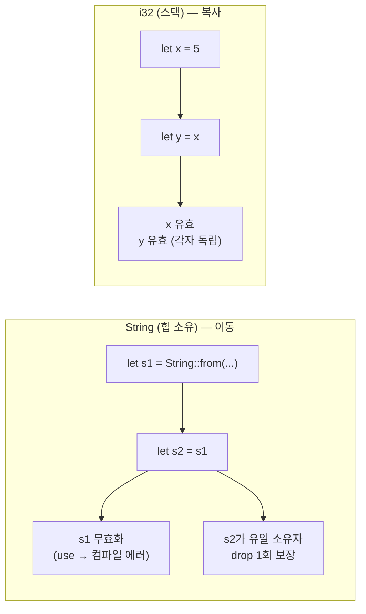
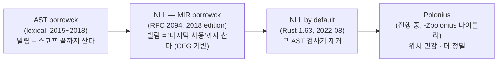

# Rust 소유권 시스템의 진화 (2010 ~ 현재)

> GC 없이 메모리 안전과 데이터 레이스 방지를 **컴파일 타임에** 달성한, Rust를 Rust답게 만드는 단 하나의 아이디어. use-after-free·이중 해제·데이터 레이스를 런타임 비용 0으로 잡아내는 소유권·빌림·라이프타임의 설계와, 그 검사기(borrow checker)가 lexical → NLL → Polonius로 진화해 온 과정을 다룬다.

## 한눈에 보기

| 구분 | 핵심 |
|------|------|
| 해결하려는 문제 | use-after-free, double free, 버퍼 무효화(iterator invalidation), 데이터 레이스 |
| 해결 시점 | **컴파일 타임** (런타임 GC·참조 카운팅·락 강제 없음) |
| 3대 메커니즘 | 소유권(ownership) · 빌림(borrowing) · 라이프타임(lifetime) |
| 강제 주체 | borrow checker — 컴파일러의 정적 분석 패스 |
| 검사기 진화 | AST borrowck(lexical, ~2018) → MIR borrowck(NLL, 2018~) → Polonius(진행 중) |
| 비용 모델 | "zero-cost" — 안전성 검사는 컴파일 타임에만 존재, 런타임 표현은 raw 포인터와 동일 |

## 시대적 배경

C/C++는 수동 메모리 관리로 최고의 성능과 제어권을 주었지만, 그 대가로 메모리 안전 결함(use-after-free, double free, 버퍼 오버런)이 끊이지 않았다. Microsoft·Google의 보안 분석은 자사 코드베이스 심각 취약점의 약 70%가 메모리 안전 문제임을 반복적으로 보고했다. 반대편의 Java·Go·C#은 가비지 컬렉터(GC)로 이 문제를 런타임에 해결했지만, GC는 stop-the-world 지연·메모리 오버헤드·예측 불가능한 일시정지를 가져왔고, 시스템 프로그래밍(OS·임베디드·게임 엔진·브라우저)에는 부적합했다.

Rust의 출발점(Graydon Hoare, 2006~, Mozilla 후원 2009~)은 이 양자택일을 거부하는 것이었다. **"GC 없는 메모리 안전"** — 런타임에 추적하던 일을 타입 시스템으로 끌어올려 컴파일 타임에 증명하자는 발상이다. 그 핵심 장치가 소유권 시스템이다. 소유권은 *누가 메모리를 책임지고 언제 해제하는가*를 컴파일러가 정적으로 알 수 있게 만들고, 빌림 규칙은 *공유 가변(shared mutable)* 을 금지해 데이터 레이스와 메모리 무효화를 동시에 차단한다. Rust 1.0(2015년 5월)이 안정화한 이 모델은 이후 "fearless concurrency(겁 없는 동시성)"라는 표어로 불리게 된다.

## 핵심 메커니즘 1 — 소유권 (Ownership)

소유권은 세 가지 규칙으로 요약된다(Rust Book, ch.4):

1. Rust의 모든 값에는 **소유자(owner)** 가 있다.
2. 한 시점에 소유자는 **단 하나**다.
3. 소유자가 스코프를 벗어나면 값은 **drop**(해제)된다.

```rust
{
    let s = String::from("hello"); // s가 힙 버퍼의 소유자
    // s 사용 가능 ...
} // 스코프 종료 → drop(s) 자동 호출 → 힙 메모리 해제 (free)
```

해제 시점이 소유자의 스코프와 묶이므로, 개발자가 `free()`를 직접 부르지 않아도, GC가 런타임에 추적하지 않아도 된다. 컴파일러가 drop 호출을 *정확히 한 번* 코드에 삽입한다(이것이 RAII — Resource Acquisition Is Initialization — 패턴의 일반화다).

## 핵심 메커니즘 2 — 이동 (Move)

규칙 2("소유자는 하나")가 대입·전달에서 어떻게 강제되는가? 힙 데이터를 가진 값을 다른 변수에 대입하면 소유권이 **이동(move)** 하고, 원래 변수는 *무효화*된다.

```rust
let s1 = String::from("hello");
let s2 = s1;            // 소유권이 s1 → s2로 이동(move). s1은 이제 무효
// println!("{}", s1);  // 컴파일 에러: borrow of moved value: `s1`
println!("{}", s2);     // OK
```

이 한 줄의 무효화가 곧 **이중 해제(double free) 방지**다. 만약 `s1`과 `s2`가 둘 다 유효하다면 스코프 종료 시 *같은 힙 버퍼*에 대해 drop이 두 번 호출되어 double free가 발생한다. 소유자를 하나로 강제함으로써 컴파일러는 drop이 정확히 한 번 일어남을 보장한다.

스택에만 사는 단순 타입(`i32`, `bool`, `char` 등)은 `Copy` 트레이트를 구현하여, 이동 대신 **복사**된다 — 원본이 그대로 유효하다.

```rust
let x = 5;
let y = x;              // i32는 Copy → 비트 복사. x 여전히 유효
println!("{x} {y}");    // OK — 5 5
```



## 핵심 메커니즘 3 — 빌림 (Borrowing)

소유권을 매번 넘기면 함수에 값을 주고받기가 번거롭다. **참조(reference, `&`)** 로 소유권을 넘기지 않고 값을 *빌려* 쓴다.

```rust
fn calculate_length(s: &String) -> usize { // 참조를 빌림 (소유 아님)
    s.len()
} // s는 참조일 뿐 → drop되지 않음

let s = String::from("hello");
let len = calculate_length(&s); // &s: s를 빌려줌, 소유권은 s에 남음
println!("{s}의 길이는 {len}"); // s 여전히 유효
```

빌림에는 단 하나의 핵심 규칙이 있고, 이것이 Rust 안전성의 심장이다:

> 어느 시점이든 **불변 참조(`&T`)는 여러 개**를 가질 수 있거나, **가변 참조(`&mut T`)는 정확히 하나**만 가질 수 있다. 둘을 동시에는 안 된다. (aliasing XOR mutation)

```rust
let mut s = String::from("hello");

let r1 = &s;       // 불변 참조 OK
let r2 = &s;       // 불변 참조 여러 개 OK
println!("{r1} {r2}");

let r3 = &mut s;   // 가변 참조 — 위 불변 참조들이 더 이상 안 쓰일 때만 OK
r3.push_str(" world");
// println!("{r1}"); // 만약 여기서 r1을 다시 쓰면: cannot borrow `s` as mutable ...
```

**"공유하면 못 바꾸고, 바꾸려면 독점한다."** 이 규칙은 두 가지를 동시에 푼다:

- **데이터 레이스 방지**: 데이터 레이스의 정의 자체가 *둘 이상의 접근이 동시에, 하나 이상이 쓰기이며, 동기화가 없는 것*이다. `&mut`를 유일하게 강제하면 "쓰기 중 다른 접근"이 타입 수준에서 불가능해진다.
- **무효화(invalidation) 방지**: `Vec`를 누가 읽는(`&`) 동안 다른 쪽이 `push`(내부적으로 `&mut`, 재할당으로 버퍼 이동)하지 못하게 막아, dangling 포인터를 원천 차단한다.

## 핵심 메커니즘 4 — 라이프타임 (Lifetime)

참조는 *가리키는 값보다 오래 살 수 없다*. 이를 어기면 use-after-free(죽은 메모리 참조)다. 컴파일러는 모든 참조에 **라이프타임**(참조가 유효한 코드 구간)을 부여하고, 참조의 라이프타임이 대상의 라이프타임을 넘지 못하게 검사한다.

```rust
fn dangle() -> &String {     // 컴파일 에러: missing lifetime specifier
    let s = String::from("hello");
    &s                        // s는 함수 끝에서 drop → 죽은 참조를 반환하려 함
} // ← 만약 허용됐다면 호출자는 해제된 메모리를 가리키는 참조를 받음 (use-after-free)
```

대부분의 라이프타임은 컴파일러가 자동 추론(elision)하지만, 관계가 모호할 때는 명시적 **라이프타임 파라미터(`'a`)** 로 "반환 참조는 입력들과 같은 구간만큼 산다"를 알려준다.

```rust
// 반환되는 참조는 x, y 중 더 짧은 쪽의 라이프타임만큼만 유효함을 'a로 명시
fn longest<'a>(x: &'a str, y: &'a str) -> &'a str {
    if x.len() > y.len() { x } else { y }
}
```

라이프타임은 *새로운 런타임 객체가 아니다* — 순수히 컴파일 타임의 정적 정보이며, 컴파일된 기계어에는 흔적이 남지 않는다(zero-cost).

## borrow checker의 진화

소유권·빌림 규칙은 1.0부터 고정이었지만, 그 규칙을 *판정하는 알고리즘*(borrow checker)은 "안전한데 거절당하는" 정직한 코드를 점점 더 많이 통과시키는 방향으로 진화해 왔다. 정밀도가 올라갈수록 거짓 양성(false positive, 안전한데 거절)이 줄어든다.



### 1단계 — Lexical (AST 기반, 1.0 ~ 2018)

초기 검사기는 빌림의 수명을 **렉시컬 스코프**(어휘적 중괄호 블록)와 동일시했다. 즉 참조가 마지막으로 *쓰인* 지점이 아니라, 그 변수가 *선언된 블록의 끝*까지 빌림이 살아 있다고 보수적으로 가정했다. 그래서 명백히 안전한 코드가 거절되곤 했다.

```rust
// 렉시컬 시대: 거절 / NLL 이후: 통과
let mut v = vec![1, 2, 3];
let first = &v[0];          // 불변 빌림 시작
println!("{first}");        // first의 "마지막 사용" — 의미상 빌림은 여기서 끝
v.push(4);                  // lexical: "first가 블록 끝까지 산다"고 보아 에러
                            // NLL: first는 더 이상 안 쓰이므로 빌림 종료 → OK
```

이 보수성은 초보자가 가장 자주 부딪히는 마찰이었다. "분명 안전한데 컴파일러가 우긴다"는 경험의 주범이었다.

### 2단계 — NLL: Non-Lexical Lifetimes (RFC 2094, 2018)

niko matsakis가 주도한 **RFC 2094**(2017)는 빌림의 수명을 렉시컬 스코프가 아니라 **제어 흐름 그래프(CFG)** 기반으로 재정의했다. 참조의 라이프타임은 "그 참조가 *이후에 다시 쓰일 수 있는*" 코드 구간만으로 좁혀진다 — 몇 개의 연속 문장일 수도, `match`의 한 분기만일 수도 있다. 구현은 컴파일러 내부 표현인 **MIR**(Mid-level IR) 위에서 동작하는 새 검사기(MIR borrowck)로 이뤄졌다.

NLL은 Rust **2018 에디션**과 함께 도입됐고, 기존 2015 코드는 "migration mode"(구·신 검사기를 둘 다 돌려 결과를 비교)로 운영됐다. **Rust 1.63**(2022년 8월)에서 NLL이 전 에디션 기본값이 되고 구 AST 검사기가 제거되면서, 길었던 전환이 완결됐다.

NLL이 통과시키게 된 대표 패턴 — 조건 분기에서 한 쪽만 빌림이 살아 있는 경우:

```rust
use std::collections::HashMap;

fn process(map: &mut HashMap<u32, String>, key: u32) {
    match map.get_mut(&key) {       // 가변 빌림
        Some(v) => v.push_str("!"), // Some 분기에서만 빌림 사용
        None => {
            map.insert(key, String::from("new")); // 렉시컬: get_mut 빌림이
                                                  // 여기까지 산다고 보아 에러
        }                                          // NLL: None 분기엔 빌림 없음 → OK
    }
}
```

### 3단계 — Polonius (진행 중)

NLL조차 거절하는 정직한 패턴이 남았다. 가장 유명한 것이 **"problem case #3"**(NLL이 Polonius로 미룬 케이스) — 조건부로 빌린 참조를 반환하는 패턴이다.

```rust
use std::collections::HashMap;

// NLL: 거절 / Polonius: 통과
fn get_or_insert(map: &mut HashMap<u32, String>, key: u32) -> &String {
    if let Some(v) = map.get(&key) {
        return v;                 // NLL은 이 빌림이 함수 전체에 걸쳐 산다고 보수 판단
    }                             // → 아래 insert(가변 빌림)와 충돌한다며 거절
    map.insert(key, String::from("default"));
    &map[&key]
}
```

**Polonius**는 2018년 NLL을 출시하면서 떼어낸 차세대 검사기로, 빌림을 *제약(constraint)* 이 아니라 *각 지점에서 어떤 대출(loan)이 살아 있는가*로 추적하는 **위치 민감(location-sensitive)** 분석이다. NLL보다 정밀해 위 패턴을 통과시키고, "lending iterator"(자기 자신을 빌려주는 반복자) 같은 미래 패턴의 토대가 된다. 2026년 현재 나이틀리에서 `-Zpolonius` 플래그로 실험 가능하며, datalog 시제품을 대체한 확장 가능한 "alpha" 알고리즘을 나이틀리에서 안정화 가능한 수준으로 끌어올리는 작업(Rust Project Goals 2025 H1/H2)이 진행 중이다.

## 소유권이 컴파일 타임에 푸는 결함들

| 결함 | C/C++에서의 양상 | Rust가 막는 메커니즘 |
|------|------------------|----------------------|
| **use-after-free** | 해제된 메모리를 가리키는 포인터 역참조 | 라이프타임 — 참조가 대상보다 오래 못 산다 |
| **double free** | 같은 버퍼를 두 번 `free` | 이동(move) — 소유자는 하나, drop은 1회 |
| **dangling pointer 반환** | 지역변수 주소를 반환 | 라이프타임 — 죽을 참조의 반환을 거절 |
| **iterator invalidation** | 순회 중 컨테이너 변경으로 버퍼 이동 | 빌림 규칙 — `&` 중 `&mut` 금지 |
| **데이터 레이스** | 동기화 없는 동시 읽기/쓰기 | 빌림 규칙 + `Send`/`Sync` (아래) |

핵심은 이 모든 검사가 **런타임 비용 0**이라는 점이다. 컴파일이 끝나면 라이프타임도 빌림 정보도 사라지고, 기계어는 손으로 쓴 C 포인터 코드와 동일하다.

## 불변성·동시성과의 연결

소유권 모델은 *불변성(immutability)* 을 언어의 기본값으로 만든다. 변수는 기본이 불변(`let`)이고, 가변은 명시(`let mut`)해야 하며, 빌림 규칙은 "공유된 것(`&`)은 바꿀 수 없다"를 타입으로 강제한다. 즉 **공유 가변(shared mutable) 상태**라는, 동시성 버그의 근원을 언어 차원에서 추방한다.

이 불변성 규율이 그대로 동시성 안전으로 이어진다. 빌림 규칙이 단일 스레드에서 막던 "공유 가변"은 멀티 스레드에서 정확히 데이터 레이스이므로, *같은 규칙이 자동으로 스레드 안전을 보장*한다. 여기에 두 개의 마커 트레이트가 경계를 마무리한다:

- **`Send`** — 소유권을 다른 스레드로 *옮겨도* 안전한 타입.
- **`Sync`** — 참조(`&T`)를 여러 스레드가 *공유해도* 안전한 타입.

```rust
use std::thread;

let mut data = vec![1, 2, 3];
let handle = thread::spawn(move || {  // move: data 소유권을 새 스레드로 이동
    data.push(4);                     // 새 스레드가 유일 소유자
});
// data.push(5); // 컴파일 에러: data는 이미 이동됨 → 두 스레드의 동시 접근 자체가 불가능
handle.join().unwrap();
```

```rust
use std::rc::Rc;
use std::sync::Arc;
use std::thread;

// let shared = Rc::new(5);
// thread::spawn(move || { println!("{}", shared); }); // 에러: Rc<i32>는 !Send
//   → Rc의 참조 카운트는 비원자적이라 스레드 간 공유 시 레이스 → 컴파일러가 거부

let shared = Arc::new(5);             // Arc: 원자적 참조 카운트 → Send + Sync
let s2 = Arc::clone(&shared);
thread::spawn(move || { println!("{s2}"); }); // OK
```

`Rc<T>`(비원자 참조 카운트)는 `!Send`라 스레드 경계를 넘으려 하면 **컴파일이 거부**되고, 원자적 버전 `Arc<T>`만 통과한다. 데이터 레이스를 만들 *수 있는* 코드를 애초에 컴파일하지 못하게 하는 것 — 이것이 "fearless concurrency"의 실체다. 런타임 디버깅이 아니라 타입 검사로 동시성 버그를 잡는다.

## 영향과 의의

소유권 시스템은 "성능이냐 안전이냐"의 오랜 양자택일을 깨뜨린 Rust의 핵심 기여다. GC의 런타임 비용 없이 메모리 안전과 데이터 레이스 안전을 컴파일 타임에 증명한다는 발상은, 이후 시스템 프로그래밍의 기준선을 바꿨다. Linux 커널이 C가 아닌 두 번째 언어로 Rust를 받아들이고(2022~), Android·Windows가 메모리 안전 코드 비중을 Rust로 늘리며, 미국 백악관 ONCD(2024)가 메모리 안전 언어로의 전환을 권고한 흐름의 한가운데에 이 모델이 있다.

동시에 소유권은 Rust의 가장 가파른 학습 곡선이기도 하다. "borrow checker와 싸운다"는 입문기의 경험은 NLL이 상당 부분 완화했고, Polonius가 남은 false positive를 더 줄여 갈 것이다. 검사기의 진화가 *규칙을 느슨하게 하는 것이 아니라, 같은 안전 규칙을 더 똑똑하게 판정하는 것*이라는 점이 중요하다 — 안전 보장은 1.0 이래 한 번도 약해지지 않았고, 단지 정직한 코드가 점점 더 잘 통과될 뿐이다. 소유권은 Rust가 빌려준 단 하나의 개념이지만, 그 위에 불변성·동시성·자원 관리(RAII)·에러 처리까지 언어 전체가 일관되게 세워져 있다.

## 참고 출처
- [Understanding Ownership — The Rust Programming Language (Book, ch.4)](https://doc.rust-lang.org/book/ch04-00-understanding-ownership.html)
- [What is Ownership? — The Rust Programming Language](https://doc.rust-lang.org/book/ch04-01-what-is-ownership.html)
- [References and Borrowing — The Rust Programming Language](https://doc.rust-lang.org/book/ch04-02-references-and-borrowing.html)
- [RFC 2094: Non-Lexical Lifetimes (The Rust RFC Book)](https://rust-lang.github.io/rfcs/2094-nll.html)
- [RFC 2094 Pull Request (rust-lang/rfcs#2094)](https://github.com/rust-lang/rfcs/pull/2094)
- [Non-lexical lifetimes (NLL) fully stable — Rust Blog (2022-08-05)](https://blog.rust-lang.org/2022/08/05/nll-by-default/)
- [Polonius — Current status and roadmap](https://rust-lang.github.io/polonius/current_status.html)
- [Stabilizable Polonius support on nightly — Rust Project Goals 2025 H2](https://rust-lang.github.io/rust-project-goals/2025h2/polonius.html)
- [GitHub — rust-lang/polonius](https://github.com/rust-lang/polonius)
- [Fearless Concurrency — The Rust Programming Language (ch.16)](https://doc.rust-lang.org/book/ch16-00-concurrency.html)
