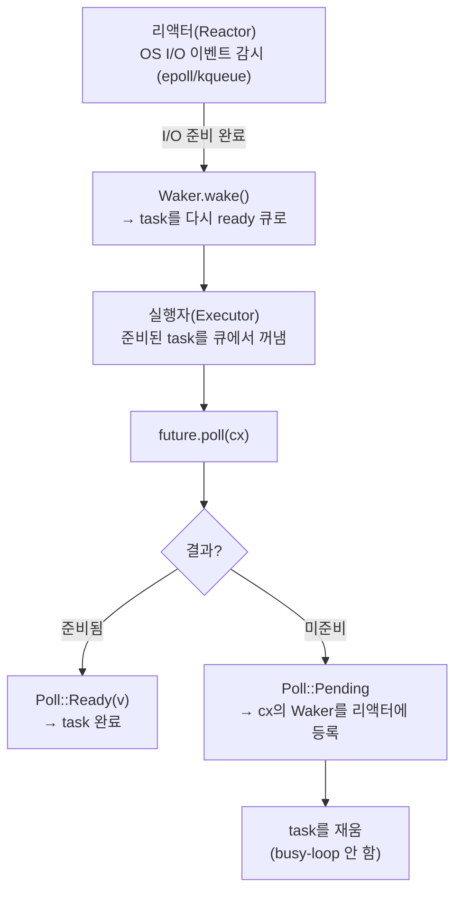
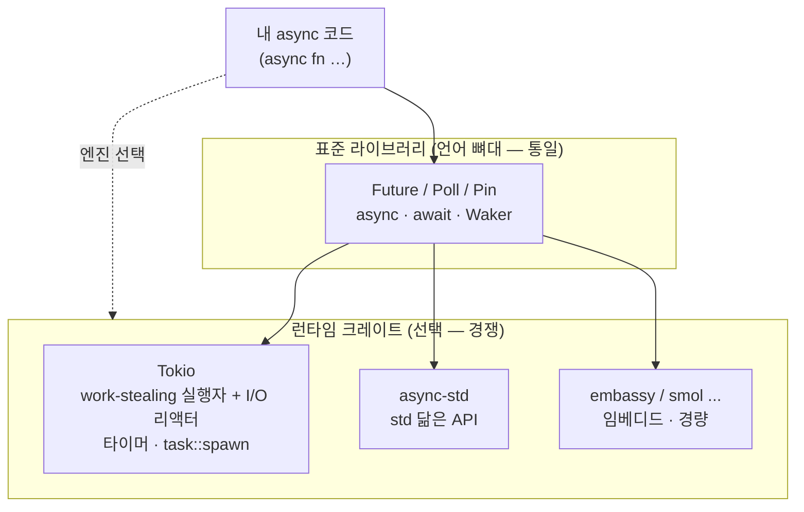

# Rust 비동기·동시성 (async/await · fearless concurrency)

> 컴파일러가 데이터 레이스를 막아주는 "두렵지 않은 동시성", 그리고 `Future`·`async/await`가 언제·왜 그런 모양으로 자리 잡았는가

Rust의 동시성 이야기는 두 갈래로 나뉜다. 하나는 **fearless concurrency** — 스레드 사이의 데이터 레이스를 런타임이 아니라 **컴파일타임에** 차단하는 타입 시스템(소유권 + `Send`/`Sync`)이다. 다른 하나는 **async/await** — OS 스레드 없이 수십만 개의 동시 작업을 굴리기 위한 무비용(zero-cost) 비동기 모델이다. 둘은 별개로 출발했지만, async 코드가 스레드 위에서 안전하게 돌아가려면 결국 `Send`/`Sync`로 묶이며 한 그림이 된다.

## 한눈에 보는 타임라인

| 시기 | 사건 |
|------|------|
| 2010~2014 | Rust 초기 — 언어에 그린 스레드/런타임이 내장돼 있었으나, "무비용" 철학과 충돌해 **1.0 이전에 제거**. 동시성은 OS 스레드 + 소유권 기반 안전성으로 정리 |
| 2015-05 | **Rust 1.0** — `Send`/`Sync` 마커 트레이트로 *fearless concurrency* 확립. async/await는 아직 없음 |
| 2016-08 | **`futures` 0.1 크레이트 공개** (Aaron Turon · Alex Crichton) — task/polling 기반 **zero-cost futures** 모델 제시 |
| 2017~2018 | Tokio 등장 — `futures` 0.1 위의 실전 비동기 I/O 런타임. 콤비네이터(`and_then`, `map`)로 future를 조립하던 시대 |
| 2018-04 | RFC 2592 등 — `async/await` 문법 + `std::future::Future` + `Pin` API 제안. `futures` 0.3로 개편 시작 |
| 2019-09-30 | async/await가 **beta** 진입 |
| 2019-11-07 | **Rust 1.39.0 — async/await 안정화** (`async fn` / `.await` / `async {}`). 핵심 아이디어는 "MVP"로 출발 |
| 2020~ | Tokio 1.0(2020-12)·async-std 성숙. 런타임은 표준 라이브러리 밖에서 경쟁 |
| 2023-12-21 | **Rust 1.75 — 트레이트의 `async fn`(AFIT) + RPITIT 안정화.** `async-trait` 크레이트 없이도 일부 사용 가능 |
| 현재 | `Pin` 복잡도, `dyn` 비동기 트레이트(객체 안전성), async 함수의 `Send` 경계 전파 등은 여전히 진행형 |

---

## 1부. Fearless Concurrency — 컴파일타임 데이터 레이스 차단

### 왜 "두렵지 않은가"
전통적으로 멀티스레드 코드의 데이터 레이스는 **런타임에, 그것도 가끔만** 터지는 가장 디버깅하기 어려운 버그였다. Rust는 이 문제를 소유권/빌림 검사기와 두 개의 마커 트레이트로 **컴파일 단계에서** 잡는다. 컴파일이 되면 데이터 레이스(`unsafe` 없이)는 구조적으로 불가능하다 — 그래서 "두려움 없이" 리팩터링하고 병렬화할 수 있다는 의미에서 *fearless concurrency*라 부른다.

> 핵심은 별도의 동시성 전용 검사기가 있는 게 아니라, **단일 스레드 안전성을 위해 만든 소유권 규칙이 멀티스레드에도 그대로 확장된다**는 점이다. "공유하려면 불변, 변경하려면 단독 소유"라는 빌림 규칙이 곧 데이터 레이스의 정의("동시 접근 + 최소 하나의 쓰기")를 막는다.

### 두 개의 마커 트레이트: `Send`와 `Sync`
- **`Send`**: 값의 **소유권을 다른 스레드로 옮겨도** 안전한 타입. (대부분의 타입)
- **`Sync`**: 값의 **참조(`&T`)를 여러 스레드가 공유해도** 안전한 타입. 정의상 `T: Sync` ⟺ `&T: Send`.

둘 다 메서드가 없는 **마커 트레이트**이고, 컴파일러가 **자동 도출**한다(모든 필드가 `Send`면 그 구조체도 `Send`). 즉 개발자가 직접 구현할 일은 거의 없고, 대신 **타입에 이 트레이트가 붙어 있느냐를 컴파일러가 검사**한다. `thread::spawn`에 넘기는 클로저는 `Send`여야 하고, 캡처하는 값도 전부 `Send`여야 한다 — 아니면 컴파일 에러다.

```rust
use std::thread;
use std::sync::{Arc, Mutex};

fn main() {
    // Arc<Mutex<T>>: 여러 스레드가 공유(Arc) + 안전한 변경(Mutex)
    let counter = Arc::new(Mutex::new(0));
    let mut handles = vec![];

    for _ in 0..10 {
        let counter = Arc::clone(&counter);     // 참조 카운트 증가 (원자적)
        let handle = thread::spawn(move || {    // move: 소유권을 스레드로 이동
            let mut num = counter.lock().unwrap(); // 락을 잡아야만 내부 접근 가능
            *num += 1;
        });
        handles.push(handle);
    }
    for handle in handles { handle.join().unwrap(); }
    println!("결과: {}", *counter.lock().unwrap()); // 항상 10 (레이스 없음)
}
```

### `Rc` vs `Arc` — 트레이트가 막아주는 실제 사례
같은 "참조 카운트 스마트 포인터"인데도 둘의 운명이 갈리는 곳이 `Send`/`Sync`다.

```rust
use std::rc::Rc;
use std::thread;

let data = Rc::new(5);
let d = Rc::clone(&data);
thread::spawn(move || {       // ❌ 컴파일 에러:
    println!("{}", d);        //    `Rc<i32>` cannot be sent between threads safely
});
```

`Rc<T>`는 참조 카운트를 **비원자적**으로 증감한다 — 두 스레드가 동시에 `clone`/`drop`하면 카운트가 깨져 메모리 안전성이 무너진다. 그래서 `Rc`는 일부러 `Send`도 `Sync`도 아니다(`!Send + !Sync`). 멀티스레드가 필요하면 **원자적 카운트**를 쓰는 `Arc<T>`로 바꿔야 하고, 컴파일러가 그 전환을 강제한다. 단일 스레드에서는 원자 연산 비용을 안 내는 `Rc`를 쓰는 — **"안전한 기본값"이 아니라 "비용을 선택"하게 하는** Rust다운 설계다.

| 타입 | 카운트 증감 | `Send`/`Sync` | 용도 |
|------|------------|---------------|------|
| `Rc<T>` | 비원자적 | ❌ / ❌ | 단일 스레드 (빠름) |
| `Arc<T>` | 원자적 | ✅ / ✅(T가 Send+Sync면) | 멀티 스레드 공유 |
| `RefCell<T>` | — | ✅ / ❌ | 단일 스레드 내부 가변성 |
| `Mutex<T>` | — | ✅ / ✅(T: Send) | 멀티 스레드 내부 가변성 |

---

## 2부. async의 역사 — `futures` 크레이트에서 `async/await`까지

### 왜 스레드만으로는 부족했나
OS 스레드는 강력하지만 **무겁다**. 스레드 하나당 수 MB의 스택과 커널 컨텍스트 스위칭 비용이 들어, 동시 연결 수만~수십만 개를 다루는 네트워크 서버에서는 스레드-당-연결 모델이 무너진다(C10k 문제). 해법은 **하나의 스레드가 수많은 작업을 협력적으로(cooperatively) 번갈아 진행**하는 것 — I/O를 기다리는 동안 다른 작업으로 넘어가는 비동기 모델이다. 문제는 **GC도 런타임 오버헤드도 없이** 이걸 어떻게 표현하느냐였다.

### `futures` 0.1 (2016) — zero-cost의 씨앗
2016년 8월, Aaron Turon과 Alex Crichton이 `futures` 0.1 크레이트를 공개하며 **task/polling 모델**을 제시했다. 핵심은 future를 "콜백을 등록하는 객체"(힙 할당 다발)가 아니라, **실행자가 필요할 때 `poll`로 떠밀어 진행시키는 상태 기계**로 본 것이다. 이 모델은 future 하나가 **단일 상태 기계(state machine)로 컴파일**되어, 콜백 체인의 힙 할당과 가상 호출을 없앤다. 이 시기의 코드는 콤비네이터로 future를 조립했다.

```rust
// futures 0.1 시절 — 콤비네이터로 future를 손으로 조립 (콜백 지옥의 타입 버전)
fn load_user(id: u64) -> impl Future<Item = User, Error = Error> {
    fetch_row(id)
        .and_then(|row| parse_user(row))
        .map(|user| user.normalize())
}
```

콤비네이터 방식은 동작했지만, 분기·루프·에러 전파(`?`)가 들어가면 타입이 폭발하고 가독성이 무너졌다. "명령형 코드처럼 읽히는 비동기"가 필요했다.

### `async/await` 안정화 (2019-11-07, Rust 1.39)
RFC 2592(2018-04)를 거쳐 `std::future::Future`와 `Pin`이 표준 라이브러리에 들어가고, `futures`는 0.3로 개편됐다. 그리고 **2019년 11월 7일 Rust 1.39.0**에서 `async`/`await` 문법이 안정화됐다. 위의 콤비네이터 코드는 이렇게 바뀐다.

```rust
// Rust 1.39+ — 동기 코드와 거의 같은 모양, 하지만 .await 지점에서 양보(yield)한다
async fn load_user(id: u64) -> Result<User, Error> {
    let row = fetch_row(id).await?;      // I/O 대기 중 다른 작업에 스레드를 양보
    let user = parse_user(row)?;
    Ok(user.normalize())
}
```

세 가지 형태가 함께 안정화됐다:
- **`async fn`** — 호출하면 즉시 실행되지 않고 **`Future`를 반환**한다(게으름, lazy).
- **`async { ... }` / `async move { ... }`** — 클로저처럼 future 리터럴을 만든다.
- **`.await`** — future를 현재 task 안에서 완료까지 떠민다. **`async` 문맥 안에서만** 쓸 수 있다.

> 당시 핵심 팀은 이를 의도적으로 **"MVP(최소 기능 제품)"**라 불렀다. 즉 문법은 안정화하되, 트레이트의 async·스트림·더 나은 진단 등은 이후 과제로 남긴 것이다 — 이 "미완"의 흔적이 5부의 주제다. Niko Matsakis가 강조했듯, 다른 언어와 달리 Rust의 async/await는 **zero-cost 추상화**다(future 하나 = 스택에 박히는 상태 기계, 별도 힙 할당·GC 없음).

### `async fn`의 게으름 — 흔한 함정
`async fn`을 호출하는 것만으로는 **아무 일도 일어나지 않는다.** 반환된 future를 실행자가 `poll`해야 비로소 코드가 돈다. 이것이 다른 언어(즉시 실행되는 Promise/goroutine)와 가장 다른 점이다.

```rust
async fn say_hi() { println!("hi"); }

fn main() {
    let fut = say_hi();   // 아무것도 출력 안 됨 — future를 만들기만 함
    // fut를 실행자에 넘겨 .await 하거나 block_on 해야 "hi"가 찍힌다
}
```

---

## 3부. `Future`·`Poll`·실행자(executor)의 동작 모델

### `Future` 트레이트의 실제 모양
모든 `async fn`/`async {}`는 컴파일러에 의해 이 트레이트를 구현하는 **익명 상태 기계**로 바뀐다.

```rust
pub trait Future {
    type Output;
    // 실행자가 "진행시켜 봐"라고 떠미는 단 하나의 메서드
    fn poll(self: Pin<&mut Self>, cx: &mut Context<'_>) -> Poll<Self::Output>;
}

pub enum Poll<T> {
    Ready(T),   // 완료 — 결과 T를 들고 끝남
    Pending,    // 아직 — 준비되면 깨워달라고 Waker를 등록해 둠
}
```

### poll–wake 루프 — 협력적 스케줄링의 심장
실행자(executor)는 task를 `poll`한다. future가 **`Poll::Ready`**를 내면 완료, **`Poll::Pending`**을 내면 "아직 준비 안 됐다"는 뜻이다. 이때 중요한 규칙: **`Pending`을 반환하기 전에, future는 자기를 다시 깨워줄 `Waker`를 어딘가(I/O 리액터·타이머)에 등록해 둔다.** 그래야 실행자가 그 task를 헛되이 반복 poll하지 않고 **잠재워 둘 수 있다.** 준비가 되면(소켓에 데이터 도착 등) 리액터가 `wake()`를 호출하고, 실행자는 그 task를 다시 큐에 넣어 poll한다.



- **`Context`/`Waker`**: `poll`의 인자 `cx`는 `Waker`를 들고 있다. 이 `Waker`가 "이 task를 다시 깨우는 콜백" — 협력적 스케줄러가 빈 폴링(busy-wait)을 피하는 장치다.
- **상태 기계 변환**: `.await`가 여러 개 있는 `async fn`은 각 `.await` 지점이 상태 기계의 "멈출 수 있는 지점"이 된다. `poll`이 다시 불릴 때마다 **마지막으로 멈춘 지점부터 이어서** 실행된다 — 이것이 스레드 스택 없이 작업을 중단/재개하는 방법이다.

---

## 4부. 왜 런타임을 표준 라이브러리 밖으로 분리했나

### std가 제공하는 것 / 제공하지 않는 것
Rust 표준 라이브러리는 비동기의 **언어적 뼈대만** 담는다:

- ✅ **있는 것**: `async`/`await` 문법, `Future`·`Poll` 트레이트, `Pin`, `Context`/`Waker`.
- ❌ **없는 것**: **실행자(executor), 리액터(reactor), task 스폰, 타이머, 비동기 I/O.**

즉 `Future`를 정의할 수는 있어도, 그것을 **실제로 돌릴 엔진은 표준 라이브러리에 없다.** 그래서 async Rust를 쓰려면 거의 항상 외부 **런타임 크레이트**가 필요하다 — 가장 대표적인 것이 **Tokio**, 그리고 (한때 인기였던) **async-std**다.

### 왜 일부러 비웠나 — zero-cost와 선택의 자유
이건 미완성이 아니라 **설계 결정**이다.

1. **응용마다 최적 실행자가 다르다.** 고성능 네트워크 서버(work-stealing 멀티스레드 실행자)와 임베디드/`no_std` 환경(단일 스레드, 할당 없는 실행자)은 요구가 정반대다. 표준이 하나를 못 박으면 한쪽은 항상 손해다.
2. **zero-cost 철학.** "안 쓰는 것엔 비용을 안 낸다." async를 안 쓰는 프로그램이 스케줄러·리액터를 끌고 다닐 이유가 없다. future는 std에 두되(타입 통일), 무거운 엔진은 선택하게 한다.
3. **빠른 진화.** 런타임을 std 밖에 두면, 안정성 보장에 묶이지 않고 생태계가 빠르게 실험·개선할 수 있다.



### Tokio vs async-std — 무엇을 골랐나
- **Tokio**: 사실상의 표준. work-stealing 멀티스레드 실행자, 검증된 비동기 I/O, 방대한 생태계(`hyper`, `tonic`, `axum`). **런타임을 명시적으로 노출**한다(`#[tokio::main]`, `Runtime::new`) — 제어가 세밀한 대신 설정이 보인다.
- **async-std**: 표준 라이브러리와 **거의 같은 API**로 친숙함을 노렸다(런타임을 암묵적으로 숨김). 한때 양대 산맥이었으나, 생태계가 Tokio로 수렴하며 현재는 유지보수 모드에 가깝다.

> 단점도 분명하다. 런타임이 갈리면서 **생태계 파편화**가 생긴다 — Tokio용 라이브러리를 async-std 위에서 그냥 쓰지 못하는 일이 잦다(특히 I/O·타이머처럼 리액터에 묶인 것). "런타임을 고른다"는 자유의 이면이다.

---

## 5부. 아직 미완인 영역 — `Pin` 복잡도와 async 트레이트

2019년 안정화가 "MVP"였던 만큼, 거친 모서리가 남아 있다. async Rust를 어렵게 만드는 주범 둘이다.

### `Pin` — 자기참조 상태 기계를 위한 필요악
`async fn`이 상태 기계로 컴파일될 때, 함수 안의 지역 변수가 **같은 함수 안의 다른 값을 참조**하는 경우가 생긴다(자기참조 구조체, self-referential). 그런데 future는 실행자가 여기저기 옮길(move) 수 있는 값이다 — 만약 옮기면서 메모리 주소가 바뀌면, 그 내부 자기참조 포인터는 **무효한 주소를 가리키게 된다(dangling).**

`Pin<&mut T>`은 "이 값을 메모리에서 **더 이상 옮기지 못하게 고정한다**"는 타입 수준 약속으로 이 문제를 막는다. 그래서 `Future::poll`의 `self`가 `Pin<&mut Self>`인 것이다.

```rust
// 왜 Pin이 필요한가 — async 블록이 만드는 자기참조의 모습(개념)
async fn f() {
    let s = String::from("hi");
    let r = &s;            // r은 같은 future 안의 s를 가리킨다 (자기참조)
    some_io().await;       // 이 지점에서 future가 통째로 move되면 r이 무효해진다
    println!("{r}");       // → Pin이 move를 금지해 이 참조를 지켜준다
}
```

문제는 **`Pin`의 사용성**이다. 직접 future를 손으로 구현하거나(`Stream`, 수동 `poll`) `Pin`을 다뤄야 할 때, `Pin`/`Unpin`/`pin!`/`Box::pin`의 규칙은 Rust에서 가장 가파른 학습 곡선 중 하나로 꼽힌다. 평범한 `async/await`만 쓰면 컴파일러가 숨겨주지만, 추상화의 틈이 보이는 순간 복잡도가 새어 나온다.

### 트레이트 안의 `async fn` (AFIT) — 2023년에야 절반 해결
오랫동안 **트레이트 메서드에 `async fn`을 직접 쓸 수 없었다.** 이유는 `async fn`의 반환 타입이 컴파일러가 만든 **익명 future 타입**이라, 트레이트에 그 타입을 적을 방법이 없었기 때문이다(반환 위치 `impl Trait`가 트레이트에서 안 됐다). 우회책이 `async-trait` 크레이트였다 — 매크로로 반환 타입을 **`Pin<Box<dyn Future + Send>>`로 박싱**해 우회한다. 동작하지만 **힙 할당 + 동적 디스패치 비용**을 매 호출마다 낸다(zero-cost가 깨진다).

```rust
// 과거 (async-trait 크레이트) — 매크로가 Pin<Box<dyn Future>>로 박싱
#[async_trait]
trait Repository {
    async fn find(&self, id: u64) -> User;   // 실제론 박싱된 future 반환
}

// 현재 (Rust 1.75+, 2023-12) — 네이티브 async fn in trait, 박싱 없음
trait Repository {
    async fn find(&self, id: u64) -> User;   // RPITIT로 컴파일, 정적 디스패치
}
```

**Rust 1.75(2023-12-21)**에서 트레이트의 `async fn`(AFIT)과 RPITIT(`-> impl Trait` in trait)가 안정화되며 정적 디스패치 경로가 열렸다. 다만 **여전히 남은 제약**이 있어 `async-trait`는 아직 쓰인다:

- **`dyn` 호환 불가**: `async fn`을 가진 트레이트는 아직 `dyn Trait`로 (객체 안전하게) 쓸 수 없다 — 동적 디스패치가 필요하면 여전히 박싱(`async-trait`)이 필요하다.
- **`Send` 경계 전파의 어려움**: 반환 future가 `Send`인지를 트레이트 수준에서 조건부로 표현하기 까다롭다(멀티스레드 실행자는 future가 `Send`여야 한다). auto trait이 async 트레이트 경계를 매끄럽게 흐르지 못한다.

> 이 두 가지(`Pin`의 노출과 async 트레이트의 미완)가 "async Rust는 어렵다"는 평판의 실체다. 문법은 동기 코드처럼 단순해 보이지만, 추상화 아래의 상태 기계·`Pin`·런타임 경계가 특정 상황에서 표면으로 올라온다.

---

## 영향과 의의

Rust 동시성의 유산은 **"안전을 런타임 비용 없이 타입으로 산다"**는 한 문장으로 요약된다.

- **Fearless concurrency**는 GC도 락의 규율(convention)도 아닌 **타입 시스템**으로 데이터 레이스를 컴파일타임에 없앴다. `Send`/`Sync`는 별도 기능이 아니라 소유권 규칙의 자연스러운 확장이며, 그래서 단일 스레드 안전성과 멀티 스레드 안전성이 **같은 검사기**로 보장된다.
- **async/await**는 GC 언어들이 런타임에 얹은 비동기를, Rust는 **컴파일타임 상태 기계 변환**으로 무비용화했다. `Future`를 std에 통일하되 실행자는 밖에 둔 분리 설계는, 고성능 서버부터 `no_std` 임베디드까지 같은 문법을 쓰게 했다 — Tokio 생태계(`axum`, `tonic`, `hyper`)가 그 위에서 번성했다.
- 대가도 분명하다. **런타임 파편화**(Tokio/async-std 비호환), **`Pin`/함수 색깔(async ↔ sync) 문제**, **트레이트 async의 미완**은 여전히 진행형 과제다. 그럼에도 이 모델은 "안전성과 성능은 양자택일"이라는 통념을 깨뜨린 가장 성공적인 사례로 남았다.

## 참고 출처
- [Async-await on stable Rust! (Rust Blog, 2019-11-07)](https://blog.rust-lang.org/2019/11/07/Async-await-stable/)
- [Announcing Rust 1.39.0 (Rust Blog, 2019-11-07)](https://blog.rust-lang.org/2019/11/07/Rust-1.39.0/)
- [Zero-cost futures in Rust (Aaron Turon, 2016-08)](http://aturon.github.io/blog/2016/08/11/futures/)
- [RFC 2592 — futures (The Rust RFC Book)](https://rust-lang.github.io/rfcs/2592-futures.html)
- [The Future Trait — Asynchronous Programming in Rust (async book)](https://rust-lang.github.io/async-book/02_execution/02_future.html)
- [Task Wakeups with Waker — async book](https://rust-lang.github.io/async-book/02_execution/03_wakeups.html)
- [The Async Ecosystem — async book](https://rust-lang.github.io/async-book/08_ecosystem/00_chapter.html)
- [Future in std::future — Rust std docs](https://doc.rust-lang.org/std/future/trait.Future.html)
- [Fearless Concurrency — The Rust Programming Language (book, ch16)](https://doc.rust-lang.org/book/ch16-00-concurrency.html)
- [Extensible Concurrency with Send and Sync — The Rust Programming Language](https://doc.rust-lang.org/book/ch16-04-extensible-concurrency-sync-and-send.html)
- [Async in depth — Tokio Tutorial](https://tokio.rs/tokio/tutorial/async)
- [Announcing `async fn` and return-position `impl Trait` in traits (Rust Blog, 2023-12-21)](https://blog.rust-lang.org/2023/12/21/async-fn-rpit-in-traits/)
- [Stabilizing async fn in traits in 2023 (Inside Rust Blog)](https://blog.rust-lang.org/inside-rust/2023/05/03/stabilizing-async-fn-in-trait.html)
- [async_trait crate (docs.rs)](https://docs.rs/async-trait)
- [The State of Async Rust: Runtimes (corrode.dev)](https://corrode.dev/blog/async/)
- [Rust Gets Zero-Cost Async/Await Support in Rust 1.39 (InfoQ, 2019-11)](https://www.infoq.com/news/2019/11/rust-async-await/)
